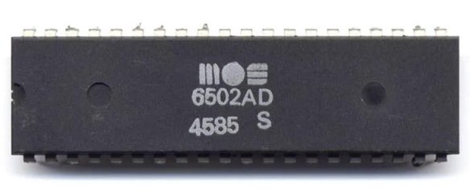

# 🚀 Guía del Juego: Memoria Espacial 🌟

**Versión:** 1.0  
**Fecha:** 02 de febrero de 2026

---

## 📖 ¿Qué es Memoria Espacial?

Memoria Espacial es un juego interactivo de memoria con temática espacial donde debes encontrar todas las parejas de emojis ocultas. El juego pone a prueba tu capacidad de concentración y memoria visual mientras disfrutas de un diseño atractivo con efectos visuales espaciales.

---

## 🎮 Cómo Jugar

1. **Inicio del juego**: Al cargar la página, verás un tablero con 16 cartas boca abajo
2. **Voltear cartas**: Haz clic en cualquier carta para revelar el emoji oculto
3. **Encontrar parejas**: Busca la carta que tenga el mismo emoji
4. **Emparejar**: Cuando encuentres dos cartas iguales, permanecerán visibles
5. **Ganar**: Completa todas las 8 parejas para ganar el juego

---

## 🎯 Características del Juego

### 📊 Sistema de Estadísticas
- **⏱️ Temporizador**: Cuenta el tiempo desde que volteas la primera carta
- **🎯 Contador de movimientos**: Registra cada intento de emparejar cartas
- **✨ Parejas encontradas**: Muestra tu progreso (X/8 parejas)

### 🎨 Elementos Visuales
- **Fondo espacial animado**: Degradado oscuro con estrellas parpadeantes
- **Efectos de brillo**: Título con animación luminosa
- **Animaciones de cartas**: Efecto de volteo 3D y animación de emparejamiento
- **Fuegos artificiales**: Celebración visual al completar el juego

---

## 🔧 Funciones Principales

### 🌟 `createStars()`
**Propósito**: Genera el fondo estrellado del juego

Crea 100 estrellas aleatorias que aparecen en diferentes posiciones de la pantalla con animaciones de parpadeo para simular un cielo nocturno espacial.

---

### 🔀 `shuffle(array)`
**Propósito**: Mezcla aleatoriamente las cartas

Utiliza el algoritmo Fisher-Yates para reorganizar aleatoriamente el array de emojis, asegurando que cada partida sea diferente y desafiante.

---

### 🎴 `createBoard()`
**Propósito**: Construye el tablero de juego

- Limpia el tablero anterior
- Duplica los 8 emojis espaciales para crear 8 parejas
- Mezcla las cartas aleatoriamente
- Crea los elementos HTML para cada carta
- Añade los eventos de clic a cada carta

---

### 🔄 `flipCard()`
**Propósito**: Gestiona el volteo de cartas

Esta función se activa cuando haces clic en una carta y realiza las siguientes acciones:
- Verifica que no haya más de 2 cartas volteadas
- Previene voltear cartas ya emparejadas
- Inicia el temporizador en el primer movimiento
- Añade la carta al array de cartas volteadas
- Llama a la función de comprobación cuando hay 2 cartas volteadas

---

### ✅ `checkMatch()`
**Propósito**: Comprueba si dos cartas son iguales

- Compara los emojis de las dos cartas volteadas
- Si coinciden: marca las cartas como emparejadas y actualiza el contador
- Si no coinciden: vuelve a ocultar las cartas después de 1 segundo
- Incrementa el contador de movimientos
- Verifica si se han encontrado todas las parejas para finalizar el juego

---

### ⏱️ `updateTimer()`
**Propósito**: Actualiza el cronómetro cada segundo

Calcula el tiempo transcurrido desde el inicio del juego y lo muestra en la interfaz.

---

### 🎉 `endGame()`
**Propósito**: Finaliza el juego y muestra la pantalla de victoria

- Detiene el temporizador
- Calcula las estadísticas finales
- Muestra el panel de victoria con tiempo y movimientos
- Lanza la animación de fuegos artificiales

---

### 🎆 `createFirework()`
**Propósito**: Crea un efecto visual de fuego artificial

Genera un emoji de estrella que aparece en una posición aleatoria y se expande con una animación para celebrar la victoria.

---

### 🆕 `startGame()`
**Propósito**: Inicia una nueva partida

Reinicia todos los valores del juego y crea un nuevo tablero con las cartas mezcladas aleatoriamente.

---

### 🔄 `resetGame()`
**Propósito**: Reinicia el juego actual

- Detiene el temporizador
- Reinicia todos los contadores a cero
- Limpia las cartas volteadas
- Oculta el panel de victoria
- Crea un nuevo tablero

---

## 🎨 Emojis Espaciales Incluidos

El juego incluye 8 emojis con temática espacial:

- 🚀 Cohete
- 🌙 Luna
- ⭐ Estrella
- 🪐 Saturno
- 🛸 OVNI
- ☄️ Cometa
- 🌍 Tierra
- 👽 Alienígena

---

## 💡 Consejos y Estrategias

1. **📍 Memoriza posiciones**: Intenta recordar dónde están los emojis que has visto
2. **🧠 Concentración**: Presta atención a cada carta que volteas
3. **⚡ Velocidad vs Precisión**: Puedes intentar hacerlo rápido o con menos movimientos
4. **🎯 Práctica**: Juega varias veces para mejorar tu tiempo y reducir movimientos

---

## 🎮 Controles

### Botones Disponibles
- **🎮 Nueva Partida**: Comienza un juego completamente nuevo
- **🔄 Reiniciar**: Reinicia el juego actual manteniendo las mismas posiciones

### Interacción
- **Clic en carta**: Voltea una carta para ver el emoji oculto
- **Clic en botón victoria**: Jugar de nuevo después de ganar

---

## 🌈 Efectos Visuales y Animaciones

### Efectos de Fondo
- Degradado oscuro espacial con colores púrpura y azul
- 100 estrellas animadas con efecto de parpadeo
- Diseño responsivo que se adapta a diferentes tamaños de pantalla

### Animaciones de Cartas
- **Efecto hover**: Las cartas se agrandan ligeramente al pasar el cursor
- **Volteo 3D**: Animación de rotación en el eje Y al voltear
- **Emparejamiento exitoso**: Animación de escala y rotación al encontrar pareja

### Efectos de Victoria
- Panel emergente con fondo oscuro semitransparente
- 10 fuegos artificiales secuenciales
- Animación de escala del panel de victoria

---

## 🏆 Sistema de Puntuación

Aunque el juego no tiene un sistema formal de puntos, puedes medir tu desempeño con:

- **Tiempo**: Intenta completar el juego en el menor tiempo posible
- **Movimientos**: Busca reducir el número de intentos
- **Desafío personal**: Intenta superar tus propios récords

---

## 🔍 Detalles Técnicos

### Estructura del Tablero
- **Cuadrícula**: 4×4 (16 cartas totales)
- **Parejas**: 8 pares de emojis
- **Diseño**: Responsivo y adaptable

### Mecánicas de Juego
- **Límite de cartas**: Solo 2 cartas pueden estar volteadas simultáneamente
- **Tiempo de visualización**: 1 segundo para memorizar cartas no coincidentes
- **Tiempo de emparejamiento**: 0.5 segundos para confirmar parejas correctas

---

## 🎓 Aspectos Educativos

Este juego ayuda a desarrollar:

- **🧠 Memoria visual**: Recordar posiciones y patrones
- **👁️ Concentración**: Mantener el foco en el objetivo
- **⚡ Agilidad mental**: Tomar decisiones rápidas
- **🎯 Resolución de problemas**: Estrategias para optimizar movimientos

---

## 🌟 Recomendaciones de Uso

### Para Estudiantes
- Úsalo como ejercicio de memoria antes de estudiar
- Compite con amigos para ver quién lo hace más rápido
- Intenta mejorar tus récords personales

### Para Educadores
- Herramienta lúdica para ejercitar la memoria
- Ejemplo de programación web con HTML, CSS y JavaScript
- Base para aprender sobre eventos, arrays y manipulación del DOM

---

## 📱 Compatibilidad

El juego funciona en:
- ✅ Navegadores web modernos (Chrome, Firefox, Safari, Edge)
- ✅ Dispositivos móviles y tablets
- ✅ Ordenadores de escritorio
- ✅ Diferentes tamaños de pantalla

---

## 🚀 ¡Comienza a Jugar!

Carga el archivo HTML en tu navegador favorito y disfruta de este emocionante juego de memoria espacial. ¡Desafía tu mente y diviértete encontrando todas las parejas!

---

## 📋 Tareas Pendientes

### 🔧 Mejoras Futuras
- [ ] Añadir niveles de dificultad (fácil, medio, difícil)
- [ ] Implementar sistema de puntuación global
- [ ] Agregar efectos de sonido para voltear cartas y emparejar
- [ ] Crear tabla de récords locales
- [ ] Añadir modo multijugador
- [ ] Diseñar nuevos temas (océano, jungle, ciudades)
- [ ] Optimizar rendimiento en dispositivos móviles
- [ ] Implementar modo oscuro/claro

### 🎨 Mejoras Visuales
- [ ] Añadir más animaciones de transición
- [ ] Crear efectos de partículas personalizados
- [ ] Diseñar nuevos fondos animados
- [ ] Mejorar la pantalla de victoria con más efectos

### 🧪 Aspectos Técnicos
- [ ] Refactorizar código para mejor mantenibilidad
- [ ] Añadir comentarios más detallados
- [ ] Crear versión con framework (React/Vue)
- [ ] Implementar almacenamiento local para guardar récords
- [ ] Optimizar algoritmos de renderizado

---

## 💾 Inspiración Retro: Microprocesador 6502

El desarrollo de juegos web modernos como Memoria Espacial tiene sus raíces en la historia de la computación. El **microprocesador 6502** fue uno de los chips más influyentes en la era dorada de los videojuegos y la computación personal.

*Microprocesador MOS 6502AD - El chip que revolucionó la industria de los videojuegos*

### 🎮 Legado del 6502
- Utilizado en consolas icónicas como **Nintendo Entertainment System (NES)** y **Atari 2600**
- Base de computadoras legendarias como **Apple II** y **Commodore 64**
- Procesador de 8 bits que revolucionó la industria en los años 70 y 80
- Inspiración para generaciones de programadores y desarrolladores de videojuegos

Aunque hoy programamos en lenguajes de alto nivel como JavaScript, HTML y CSS, el espíritu de creatividad y optimización que caracterizó a los programadores del 6502 sigue vivo en cada juego que creamos.

---

**✨ ¡Buena suerte y que disfrutes del viaje espacial! 🌌**
